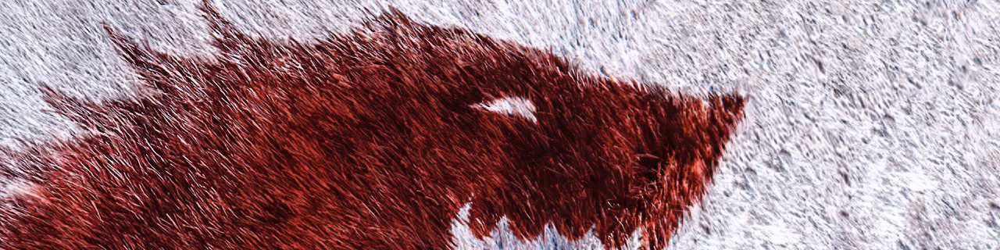

# Wolf in a Sheep

## Build

To build the project, it is necessary to have _Maven +3.5.0_, and
_Java SE 8 Release_ installed. Then, run:

```
$ mvn clean package
```

This will generate a _\*.jar_ in the root folder. If you find any issues with
the building, remove the _\*.jar_ files from the _Maven_ local repository
with:

```
$ rm -fr ~/.m2/repository/ar/nadezhda/*
```

Or do it manually, if you prefer.

## Execute

In the root folder (after build):

```
$ java -jar stegobmp.jar <arguments>
```

## Designer

This project has been built, designed and maintained by:

* [Agustín Golmar](https://github.com/agustin-golmar)
