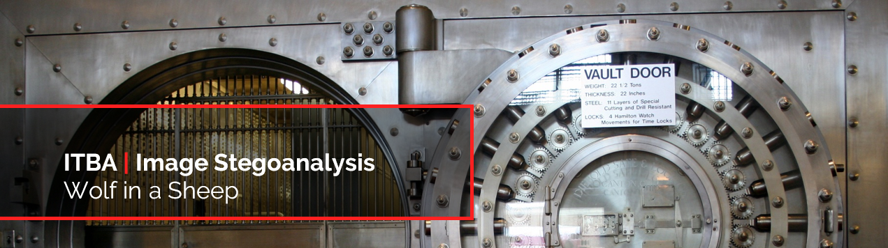

[](https://img.shields.io/badge/Password-fuckyou-red.svg)
[](https://github.com/agustin-golmar/Wolf-in-a-Sheep/blob/master/LICENSE.md)
[](https://github.com/agustin-golmar/Wolf-in-a-Sheep/releases)
[](https://www.travis-ci.com/agustin-golmar/Wolf-in-a-Sheep)
[](https://snyk.io/test/github/agustin-golmar/Wolf-in-a-Sheep?targetFile=pom.xml)

# Wolf in a Sheep

A steganographer-encrypter application for hiding a wolf in a sheep. This only
work over images of type _BMP v3_ of 24-bits, without compression.

## Build

To build the project, it is necessary to have _Maven +3.5.0_, and
_Java SE 8 Release_ installed. Then, run:

```
$ mvn clean package
```

This will generate a _\*.jar_ in the root folder. If you find any issues with
the building, remove the _\*.jar_ files from the _Maven_ local repository
with:

```
$ rm -fr ~/.m2/repository/ar/nadezhda/*
```

Or do it manually, if you prefer.

## Execution

In the root folder, type:

```
$ java -jar stegobmp.jar <arguments>
```

Where the arguments can be:

* `-embed`: If you want to hide a wolf in a sheep.
* `-extract`: If you want to get back the wolf you hid in a sheep.
* `-in`: The wolf you want to hide (only for _-embed_).
* `-p`: The sheep in which you will hide the wolf, or the final sheep with a
hidden wolf ready for extraction.
* `-out`: The final sheep, with the wolf inside.
* `-steg`: The steganographer. Must be _LSB1_, _LSB4_, _LSB8_ or _LSBE_.
* `-a`: The cipher involved. Must be _aes128_, _aes192_, _aes256_ or _des_.
* `-m`: The operating mode of the cipher. Must be _ecb_, _cfb_, _ofb_, _cbc_ or _ctr_.
* `-pass`: The password for the cipher.

By default, `stegobmp` will:

* Use _aes128_ as the cipher (in case you provide a password).
* Use _cbc_ as the cipher mode.
* Use _SHA-256_ for the hashing of the password (without _salt_).
* Use an _OpenSSL_-like [EVP_BytesToKey](https://www.openssl.org/docs/man1.1.0/crypto/EVP_BytesToKey.html)
algorithm for key and IV deterministic derivation.
* Use _PKCS5_ as the wolf-padding mechanism (only for _ECB_ and _CBC_ mode).
* Use 8-bits feedback mode in _CFB_, and 128-bits in _OFB_ and _CTR_.

> __NOTE:__ If you wish to encrypt with larger keys for _AES_ cipher (_i.e._,
> 192 or 256 bits), you must install the [Java Cryptography Extension (JCE)
> Unlimited Strength Jurisdiction Policy Files 8](http://www.oracle.com/technetwork/java/javase/downloads/jce8-download-2133166.html).
> This way, you can run the cipher with every key-length desired.

## Final Solver

The solver is a script for __\*nix__ environments that unzips a set of 4
_stego objects_ and apply an extraction process. You can run it in the root
of the repository with:

```
$ chmod 500 solver.sh
$ ./solver.sh <folder>
```

Where _\<folder\>_ is the name of the folder where to extract the solutions.

## Libraries

This application uses these _Java_ libraries to complete its task:

* __[Apache Commons-Lang v3.7](https://commons.apache.org/proper/commons-lang/)__:
for the mutable values, needed to make an effectively-final hack.
* __[JCommander v1.72](http://jcommander.org/)__: for parsing the command line
input parameters.

## Designer

This project has been built, designed and maintained by:

* [Agustín Golmar](https://github.com/agustin-golmar)

And in case you are asking yourself... no, I'm not a sheep.

## Bibliography

__"Introduction to Modern Cryptography"__. Jonathan Katz and Yehuda Lindell.
_1st Edition. CRC Press. 2007_.

__"Efficient Method of Audio Steganography by Modified LSB Algorithm and
Strong Encryption Key with Enhanced Security"__. R. Sridevi, Dr. A. Damodaram
and Dr. Svl. Narasimham. _Vol. 5, N° 6, Journal of Theoretical and Applied
Information Technology. JNTUCEH, Hyderabad. 30th June, 2009_.

__"Steganography and Digital Watermarking"__. Jonathan Cummins, Patrick
Diskin, Samuel Lau and Robert Parlett. _School of Computer Science, The
University of Birmingham. 2004_.

__"Análisis de Técnicas Esteganográficas y Estegoanálisis en Canales
Encubiertos, Imágenes y Archivos de Sonido"__. Gustavo A. Isaza E., Carlos
Alberto Espinosa A. and Sandra M. Ocampo C. _Vector, Vol. 1, N° 1, p29-38.
December 2006_.

__"Esteganografía"__. Dr. Roberto Gómez Cárdenas. _Maestría en Seguridad
Informática. ITESM-CEM. Tecnológico de Monterrey_.

__"Exploring Steganography: Seeing the Unseen"__. Neil F. Johnson and Sushil
Jajodia. _George Mason University. February, 1998_.

__"Enhanced Least Significant Bit Algorithm for Image Steganography"__. Shilpa
Gupta, Geeta Gujral and Neha Aggarwal. _IJCEM International Journal of
Computational Engineering & Management. Vol. 15, Issue 4. July, 2012_.
